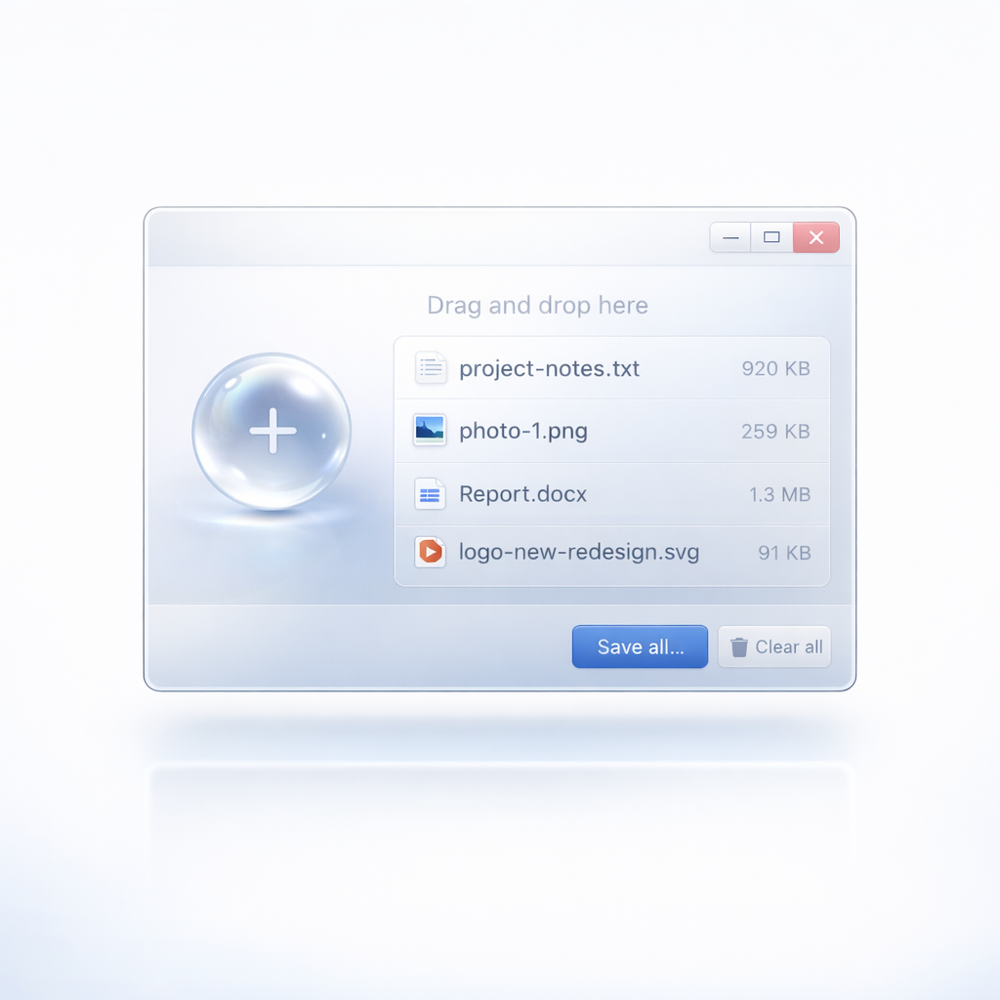

# onetool

Windows 本地高频小工具箱。

`v0.2.0` 已发布，当前以 Windows 桌面使用场景为主，提供安装版与便携版下载。


[下载最新版本](https://github.com/tomfocker/onetool/releases/latest) | [查看发行版](https://github.com/tomfocker/onetool/releases) | [Windows 发布说明](./docs/distribution/windows-release.md)


## 这是什么

`onetool` 是一个面向日常 Windows 桌面使用的本地工具箱，把装机、文件处理、录屏截图、网页操作、系统检测这类常用能力收在一个统一界面里。

它更强调：

- 本地执行，尽量少依赖外部服务
- 高频功能集中，不用在多个小工具之间来回切换
- 以桌面真实使用体验为优先，而不是做一组零散 demo

## 代表功能

### 文件暂存悬浮球

适合临时收纳、跨窗口拖放和桌面整理。



### 屏幕录制与截屏工作流

支持录屏、区域选择、截图相关能力，适合演示、反馈和内容制作。


### 网页激活与自动化辅助

把重复网页操作收进一个工具入口，减少重复点击和切换。


## 核心能力

- 装机与环境准备：常用软件安装、开发环境管理、系统配置检测
- 文件与桌面效率：批量重命名、下载整理、文件暂存悬浮球、剪贴板管理
- 多媒体与捕获：屏幕录制、截图、取色、图片处理、二维码生成
- 网络与系统辅助：网页激活、网络雷达、空间清理、WSL 管理、屏幕翻译

## 下载与安装

当前发布页提供两种 Windows 包：

- 安装版：`onetool-0.2.0-win-x64-setup.exe`
- 便携版：`onetool-0.2.0-win-x64-portable.exe`

选择建议：

- 长期使用，优先安装版
- 临时试用、随身携带或不想安装，使用便携版

当前 `v0.2.0` 为未签名构建，Windows 可能出现 `SmartScreen` 或“未知发布者”提示。

更新行为：

- Windows 安装版支持后续通过 GitHub Releases 检查更新
- Windows 便携版不启用自动更新

## 当前版本定位

`v0.2.0` 是首个明显偏向基础能力升级的 Windows 版本，当前发布重点是：

- 建立全局 LLM 能力层和首批 AI 增强工具
- 收口主进程启动链与 settings/store 迁移基线
- 保持 Windows 安装版更新链路与 GitHub Release 对齐

暂不承诺：

- 多平台正式发布一致性
- 签名证书与 SmartScreen 信誉积累

## 本地开发

安装依赖：

```bash
npm install
```

启动开发模式：

```bash
npm run dev
```

如果要在开发环境里验证“空间清理”的 `NTFS` 极速扫描，请先执行一次：

```bash
npm run build:ntfs-fast-scan
```

本地构建：

```bash
npm run build
```

Windows 正式打包：

```bash
npm run release:win
```

如果在本机执行这条命令，请先确认当前 Windows 已开启“开发者模式”或使用具备创建符号链接权限的终端会话；`electron-builder` 依赖的 `winCodeSign` 解压阶段否则会在本地失败。没有这项权限时，优先使用仓库内置的 GitHub Actions `Release` 工作流产出正式安装包。

更多说明见 [docs/distribution/windows-release.md](./docs/distribution/windows-release.md)。

## 仓库结构

```text
src/
  main/        Electron 主进程
  preload/     预加载桥接
  renderer/    前端界面与工具页面
resources/     应用资源与随包依赖
website/       官网与 README 预览素材
docs/          发布与分发文档
```

## 作者

**八骏马**

- Bilibili: [https://space.bilibili.com/35149135](https://space.bilibili.com/35149135)

## 许可证

MIT License
